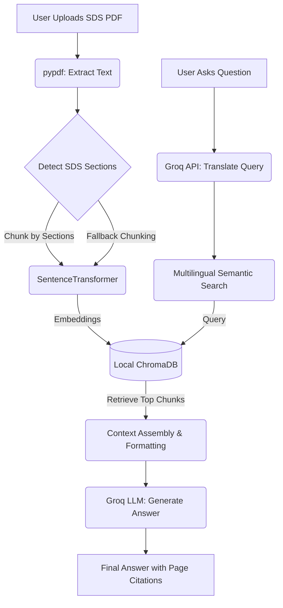

# SDSense AI – Minimalist RAG for Safety Data Sheets

A professional, lightweight Retrieval-Augmented Generation (RAG) application built with Python, Streamlit, and ChromaDB. SDSense AI allows you to upload Safety Data Sheet (SDS) PDFs, automatically processes them using ChromaDB for semantic vector search, and accurately answers your questions using the Groq API.


## 🌟 Key Features

- **Semantic Vector Search:** Leverages `chromadb` for storing embeddings and performing robust semantic search across complex SDS documents.
- **Intelligent Chunking:** Automatically detects and chunks document sections based on standard SDS headers for precise context extraction.
- **Multilingual Support:** Translates queries to match the document's language, ensuring accurate retrieval regardless of the source language.
- **Source Citations:** Automatically cites exact page numbers from the source document to ground its answers.
- **Relevance Heuristics:** Employs advanced fallback search and relevance thresholds to prevent hallucinations and indicate when the document lacks context.
- **Lightning-Fast Generation:** Powered by Groq's API (`llama-3.3-70b-versatile`) to instantly generate comprehensive answers based strictly on your document.

## ⚙️ How It Works

1. **Upload:** Provide an SDS PDF file via the intuitive Streamlit interface.
2. **Extract & Chunk:** The app extracts text using `pypdf` and logically chunks it by detecting standard SDS sections (e.g., SECTION 1, SECTION 2).
3. **Embed & Index:** Chunks are embedded using `paraphrase-multilingual-MiniLM-L12-v2` and indexed into a local ChromaDB vector store.
4. **Translate & Query:** User queries are translated to the document's language (if necessary), and compared against embeddings to find the most relevant document sections.
5. **Generate Answer:** The highly relevant context is sent to the Groq LLM to generate an accurate, translated, and cited answer based solely on the source text.

### Architecture Flowchart



## 🔒 Data Privacy Notice

- **Local Indexing:** Text extraction, chunking, embedding generation, and vector storage (ChromaDB) are executed **entirely locally** on your machine.
- **Cloud Translation & Generation:** To ensure high-quality multilingual search and accurate answering, your search query, a small sample of the document (for language detection), and the retrieved context snippets are securely sent to the Groq API.

## 🚀 Setup Instructions

1. **Clone the repository:**
   ```bash
   git clone https://github.com/PS-kavya-patel/Project-L1.git
   cd Project-L1
   ```

2. **Create a virtual environment:**
   ```bash
   python -m venv venv
   ```

3. **Activate the virtual environment:**
   - **Windows:** `.\venv\Scripts\activate`
   - **Mac/Linux:** `source venv/bin/activate`

4. **Install dependencies:**
   ```bash
   pip install -r requirements.txt
   ```

5. **Run the application:**
   ```bash
   streamlit run app.py
   ```

## 📋 Requirements

To run this project, you will need:
- Python 3.8+
- A [Groq API Key](https://console.groq.com/keys) to leverage the LLM for translation and generation.

---
*Built with Streamlit, ChromaDB, and Groq.*
