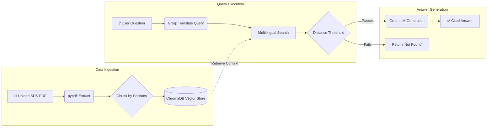
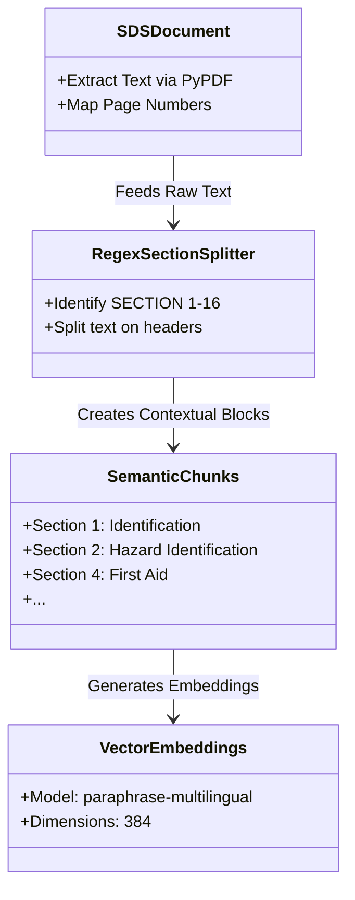

<div align="center">

# 🧪 SDSense AI
### _The Intelligent Safety Data Sheet Assistant_

[]()
[]()
[]()
[]()

*SDSense AI is a next-generation Retrieval-Augmented Generation (RAG) tool designed to make querying complex Safety Data Sheets (SDS) instantaneous, accurate, and completely multilingual.*

[Explore Features](#-core-features) • [View Architecture](#-architecture) • [Getting Started](#-quickstart)

</div>

<br/>

> **The Problem:** Safety Data Sheets are massive, highly technical, and difficult to navigate when you need critical hazard or first-aid information in an emergency. Traditional keyword searches fail when synonyms or different languages are used.  
> **The Solution:** SDSense AI ingests any SDS, chunks it intelligently based on standard safety headers, and uses hyper-fast Groq LLMs to give you precise, cited answers in seconds.

---

## ✨ Core Features

| Feature | Description |
| :--- | :--- |
| 🧠 **Semantic Vector Search** | Utilizes **ChromaDB** to store vector embeddings and perform context-aware semantic search over your documents, bypassing the limits of simple keyword matching. |
| ✂️ **Intelligent Chunking** | Automatically parses standard SDS headers (e.g., Section 1, Section 2) to extract perfectly contextualized text blocks. |
| 🌍 **Multilingual Engine** | Instantly translates your queries into the document's native language for flawless retrieval, then translates the answer back to you. |
| 📌 **Pinpoint Citations** | Eliminates hallucination by actively citing the exact `[Page X]` of the PDF where it found the answer. |
| 🛡️ **Relevance Gating** | Employs strict distance thresholds—if the answer isn't in the document, it confidently tells you *"I don't know"* instead of guessing. |

---

## 🎨 Visual Preview

<div align="center">
  
  
</div>

---

## 🏗 Architecture

SDSense AI uses a refined RAG pipeline that prioritizes both accuracy and speed:



### 🧠 Document Processing Strategy (Chunking Diagram)

To ensure the AI understands the context of chemical safety, we specifically target standard GHS (Globally Harmonized System) formatting rather than just splitting by arbitrary character limits:



---

## 💻 Tech Stack

- **Frontend:** Streamlit (Provides a reactive, easy-to-use chat interface)
- **Vector Database:** ChromaDB (Local, fast embedding storage)
- **Embeddings Model:** SentenceTransformers (`paraphrase-multilingual-MiniLM-L12-v2`)
- **LLM Engine:** Groq API (`llama-3.3-70b-versatile` for high-speed, intelligent generation)
- **PDF Processing:** PyPDF (Robust text extraction and page mapping)

---

## 🚀 Quickstart

Get the assistant running locally in under 3 minutes.

### 1. Prerequisites
Ensure you have **Python 3.8+** installed and grab your free [Groq API Key](https://console.groq.com/keys).

### 2. Setup
```bash
# Clone the repo
git clone https://github.com/PS-kavya-patel/Project-L1.git
cd Project-L1

# Create and activate environment
python -m venv venv
# Windows: .\venv\Scripts\activate
# Mac/Linux: source venv/bin/activate

# Install strictly pinned dependencies
pip install -r requirements.txt
```

### 3. Launch
```bash
streamlit run app.py
```
*Open `http://localhost:8501`, enter your Groq API key in the sidebar, and upload your first SDS!*

---

## 💬 Example Interaction

**User:** What should I do if this chemical gets in my eyes?  
**SDSense AI:** _Searching..._
* Translates query (if document is in another language).
* Retrieves chunks strictly passing the distance threshold of `1.2`.
* Extracts Section 4 (First-Aid Measures) from the document.  

**Response:** Rinse cautiously with water for several minutes. Remove contact lenses, if present and easy to do. Continue rinsing. If eye irritation persists: Get medical advice/attention. `[Page 2]`

---

## 🧪 Evaluation Suite

SDSense AI includes a repeatable evaluation script to test RAG accuracy, hallucination resistance, and context boundaries.

Run the evaluation:
```bash
python evaluate.py
```
*Tests include factual extraction, missing info detection, and distance thresholding.*

---

## 🔒 Security & Privacy

* **Local Vectorization:** Chunking, embedding (`paraphrase-multilingual-MiniLM-L12-v2`), and ChromaDB storage happen 100% locally on your hardware.
* **Cloud Inference:** Only highly relevant context snippets and your specific question are securely transmitted to Groq for generation. Your full PDF is never uploaded or retained.

<br/>
<div align="center">
  <i>Developed by <b>Kavya Patel</b></i><br/>
  <a href="https://github.com/PS-kavya-patel">GitHub Profile</a>
</div>
