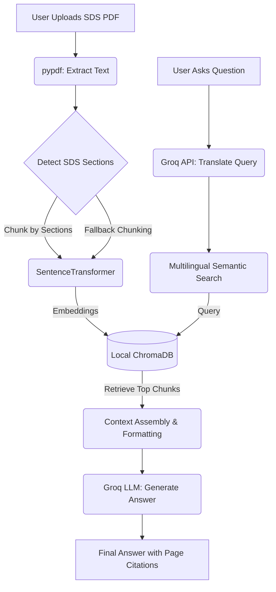

<div align="center">
  <h1 align="center">SDSense AI 🧪</h1>
  <p align="center">
    <strong>Minimalist RAG for Safety Data Sheets</strong>
    <br />
    A professional, lightweight Retrieval-Augmented Generation (RAG) application built with Python, Streamlit, and ChromaDB.
  </p>
  
  <!-- Badges -->
  <p align="center">
    
    
    
    
  </p>
</div>

<hr />

## 📖 Table of Contents
- [About The Project](#-about-the-project)
- [Key Features](#-key-features)
- [Architecture & Flowchart](#-architecture--flowchart)
- [Project Structure](#-project-structure)
- [Getting Started](#-getting-started)
- [Usage Guide](#-usage-guide)
- [Data Privacy Notice](#-data-privacy-notice)
- [License & Contact](#-license--contact)

---

## 🚀 About The Project

**SDSense AI** allows you to upload complex Safety Data Sheet (SDS) PDFs, automatically processes them using ChromaDB for semantic vector search, and accurately answers your questions using the Groq API. It eliminates the need for manual document searching by leveraging advanced natural language processing to extract precise information and cite the exact page numbers.

### Visual Preview
<div align="center">
  
  
</div>

---

## ✨ Key Features

- **Semantic Vector Search:** Leverages `chromadb` for storing embeddings and performing robust semantic search across complex SDS documents.
- **Intelligent Chunking:** Automatically detects and chunks document sections based on standard SDS headers (e.g., Section 1, Section 2) for precise context extraction.
- **Multilingual Support:** Translates queries to match the document's language, ensuring accurate retrieval regardless of the source language.
- **Source Citations:** Automatically cites exact page numbers from the source document to ground its answers and prevent hallucinations.
- **Relevance Heuristics:** Employs advanced fallback search and relevance thresholds to indicate when the document lacks context.
- **Lightning-Fast Generation:** Powered by Groq's API (`llama-3.3-70b-versatile` or `llama-3.1-8b-instant`) to instantly generate comprehensive answers based strictly on your document.

---

## 🏗 Architecture & Flowchart



---

## 📁 Project Structure

```text
Project-L1/
├── ui/
│   └── app.py              # Main Streamlit UI and RAG logic
├── requirements.txt        # Python dependencies
├── .gitignore              # Git ignore file
├── app.py                  # Entry point wrapper
├── App Screenshot 1.png    # UI preview
├── App Screenshot 2.png    # UI preview
└── README.md               # Project documentation
```

---

## 🛠 Getting Started

Follow these instructions to set up the project locally on your machine.

### Prerequisites

- **Python 3.8** or higher
- A [Groq API Key](https://console.groq.com/keys) to leverage the LLM for translation and generation.

### Installation

1. **Clone the repository**
   ```bash
   git clone https://github.com/PS-kavya-patel/Project-L1.git
   cd Project-L1
   ```

2. **Create and activate a virtual environment**
   - **Windows:** 
     ```bash
     python -m venv venv
     .\venv\Scripts\activate
     ```
   - **Mac/Linux:** 
     ```bash
     python3 -m venv venv
     source venv/bin/activate
     ```

3. **Install dependencies**
   ```bash
   pip install -r requirements.txt
   ```

---

## 💡 Usage Guide

1. **Start the application:**
   ```bash
   streamlit run app.py
   ```
2. **Configure Settings:** Open the app in your browser (usually `http://localhost:8501`), navigate to the sidebar, and enter your Groq API Key.
3. **Upload Document:** Upload an SDS PDF file using the file uploader and click "Process Document".
4. **Ask Questions:** Once processing is complete, use the chat interface to ask specific questions about the chemical, hazards, handling instructions, etc.

---

## 🔒 Data Privacy Notice

- **Local Indexing:** Text extraction, chunking, embedding generation (`paraphrase-multilingual-MiniLM-L12-v2`), and vector storage (ChromaDB) are executed **entirely locally** on your machine.
- **Cloud Translation & Generation:** To ensure high-quality multilingual search and accurate answering, your search query, a small sample of the document (for language detection), and the retrieved context snippets are securely sent to the Groq API. Your entire PDF is never uploaded.

---

## 🤝 License & Contact

**Project Lead:** Kavya Patel
**GitHub:** [PS-kavya-patel](https://github.com/PS-kavya-patel)

If you have any issues, please feel free to open an issue on the repository.
